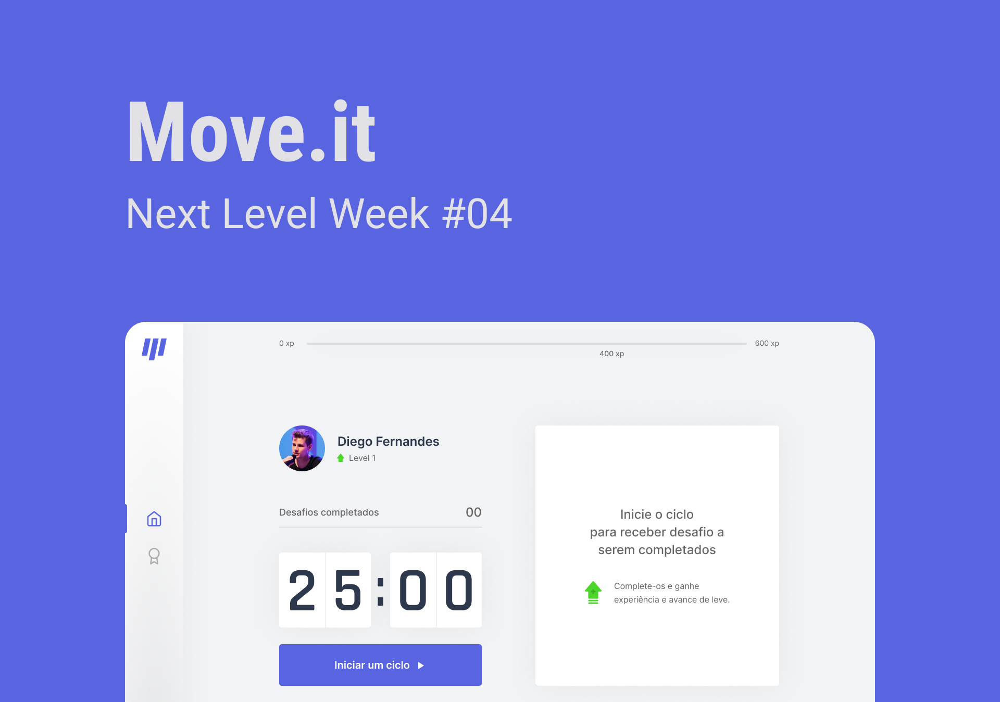
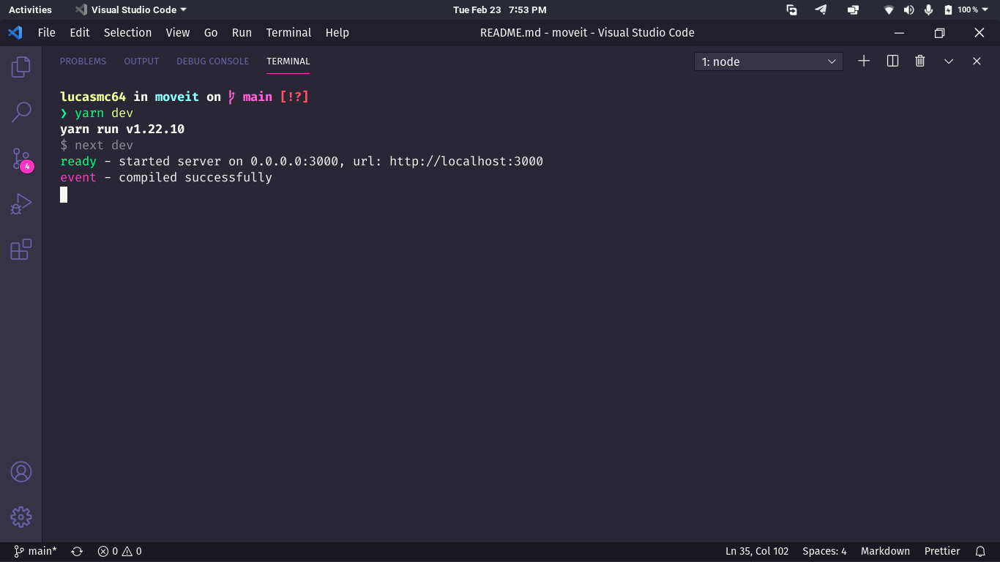

# :running: Move.it 

*This was a project developed during Next Level Week #04 (Track: ReactJS).*

> :us: If you prefer to read in another language, this README was also written in english. Click [HERE](/README.md) to access.

## :rocket: What is Next Level Week? 

The [NLW](https://nextlevelweek.com/) is a week programmed by [Rocketseat](https://rocketseat.com.br/) in which, through classes, lives, practice and with support from the community, it will help you take the next step in your evolution as a dev.

## :dart: Goal 

Move.it is a project that aims to help you focus on your tasks, but always remembering to rest, breathe and exercise. We know that time is money, but your health, matters.

## :scroll: Some details 

* The fontend is built with ReactJS and Next.js.

## :thinking: How do I run the project on my machine? 

The first step is to clone the project, either via terminal or GitHub Desktop, or even by downloading the compressed file (.zip). After that, go ahead.

### :hammer_and_wrench: Requirements 

* [Node.JS](https://nodejs.org/).
* (Optional) [Yarn](https://yarnpkg.com/).

### :mag: Installing dependencies 

With Node.JS installed, access each project directory via terminal and run the `npm install` command. If you prefer to use Yarn, just run the command `yarn`.

### :sparkles: Running the Frontend

With the dependencies properly installed, still in the terminal, run `npm run dev` or` yarn dev`. A message similar to the following will appear for you:

Now just access the address *http://localhost:3000* in your favorite browser, to see the project running.

> If this was not the result, check that the requirements and previous steps have been fulfilled.

### :tada: If everything went well... 

Now you are running the project beautifully!