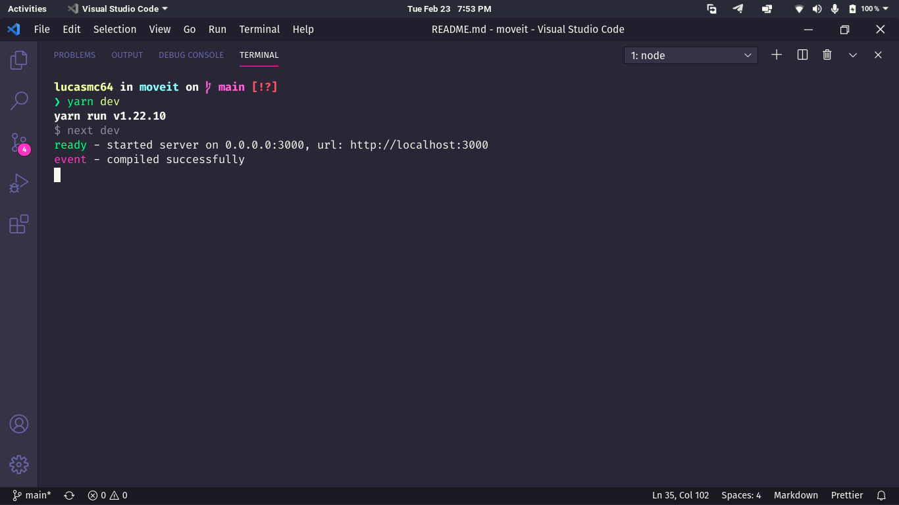

# :running: Move.it 

> :us: If you prefer to read in another language, this README was also written in english. Click [HERE](/README.md) to access.

> Esse foi um projeto desenvolvido durante a Next Level Week #04 (Trilha: ReactJS).

## :rocket: O que é a Next Level Week? 

A [NLW](https://nextlevelweek.com/) é uma semana programada pela [Rocketseat](https://rocketseat.com.br/) na qual, através de aulas, lives, prática e com apoio da comunidade, vai te ajudar a dar o próximo passo na sua evolução como dev.

## :dart: Objetivo 

Move.it é um projeto que visa te ajudar a se concentrar em suas tarefas, mas te lembrando sempre de descansar, respirar e se exercitar. Sabemos que tempo é dinheiro, mas sua saúde, importa.

## :scroll: Alguns detalhes 

* O fontend é construído com o ReactJS e Next.js.

## :thinking: Como rodar o projeto em minha máquina? 

O primeiro passo é clonar o projeto, seja via terminal ou GitHub Desktop, ou mesmo baixando o arquivo compactado (.zip). Após isso, siga adiante.

### :hammer_and_wrench: Requisitos 

* [Node.JS](https://nodejs.org/).
* (Opcional) [Yarn](https://yarnpkg.com/).

### :mag: Instalando dependências 

Com o Node.JS instalado, acesse cada o diretório do projeto via terminal e rode o comando `npm install`. Caso você prefira usar o Yarn, basta rodar o comando `yarn`.

### :sparkles: Rodando o Frontend 

Com as dependências devidamente instaladas, ainda no terminal, execute `npm run dev` ou `yarn dev`. Uma mensagem parecida com a seguinte aparecerá para você:

Agora basta acessar o endereço *http://localhost:3000* em seu navegador favorito, para ver o projeto em execução.

> Caso não tenha sido esse o resultado verifique que os requisitos e os passos anteriores tenham sido cumpridos.

### :tada: Se tudo deu certo... 

Agora você está rodando o projeto lindamente!